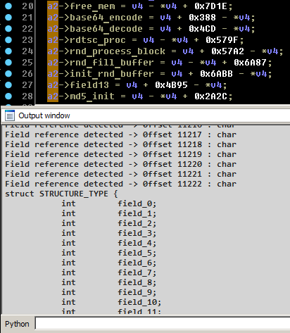
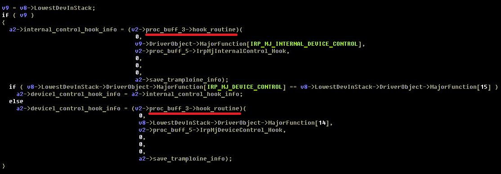
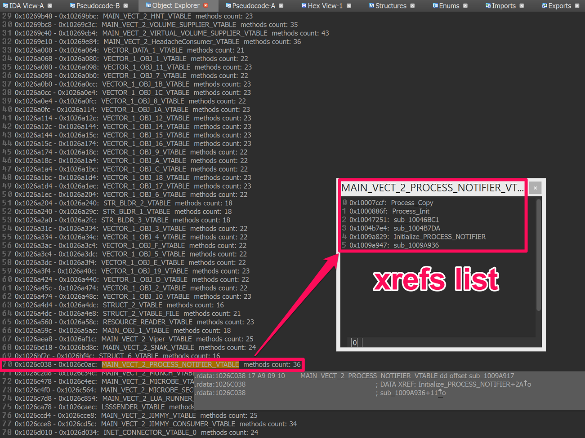
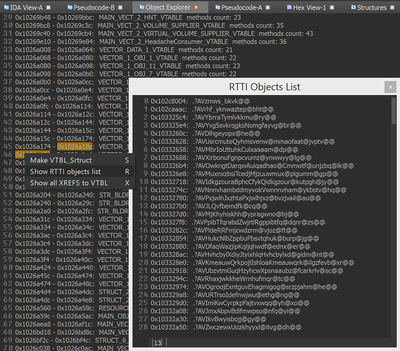

<pre>
 _   _          ______                _____           _     __   __      _                     
| | | |         | ___ \              /  __ \         | |    \ \ / /     | |                    
| |_| | _____  _| |_/ /__ _ _   _ ___| /  \/ ___   __| | ___ \ V / _ __ | | ___  _ __ ___ _ __ 
|  _  |/ _ \ \/ /    // _` | | | / __| |    / _ \ / _` |/ _ \/   \| '_ \| |/ _ \| '__/ _ \ '__|
| | | |  __/>  <| |\ \ (_| | |_| \__ \ \__/\ (_) | (_| |  __/ /^\ \ |_) | | (_) | | |  __/ |   
\_| |_/\___/_/\_\_| \_\__,_|\__, |___/\____/\___/ \__,_|\___\/   \/ .__/|_|\___/|_|  \___|_|   
                             __/ |                                | |                          
                            |___/                                 |_|</pre>
============================================================================

Hex-Rays Decompiler plugin for better code navigation in RE process of C++ applications or code reconstruction of modern malware as Stuxnet, Flame, Equation ... :octocat:

__Contributors__: 
Alex Matrosov ([@matrosov](https://github.com/matrosov)) and Eugene Rodionov ([@rodionov](https://github.com/rodionov)) 

__HexRaysCodeXplorer__ - Hex-Rays Decompiler plugin for easier code navigation. Right-click context menu in the Pseudocode window shows CodeXplorer plugin commands: 

__Here are the main features of the plugin:__

* ***Automatic type REconstruction*** for C++ objects. To be able to reconstruct a type using HexRaysCodeXplorer one needs to select the variable holding pointer to the instance of position independed code or to an object and by right-button mouse click select from the context menu «REconstruct Type» option:

  The reconstructed structure is displayed in “Output window”. Detailed information about type Reconstruction feature is provided in the blog post “[Type REconstruction in HexRaysCodeXplorer](http://rehints.com/2013-09-02-Type-REconstruction-in-HexRaysCodeXplorer.html)”.

Also CodeXplorer plugin supports auto REconstruction type into IDA local types storage.

  
* ***C-tree graph visualization*** – a special tree-like structure representing a decompiled routine in citem_t terms (hexrays.hpp). Useful feature for understanding how the decompiler works. The highlighted graph node corresponds to the current cursor position in the HexRays Pseudocode window:

* ***Navigation through virtual function calls*** in HexRays Pseudocode window. After representing C++ objects by C-structures this feature make possible navigation by mouse clicking to the virtual function calls as structure fields:

* ***Jump to Disasm*** - small feature for navigate to assembly code into "IDA View window" from current Pseudocode line position. It is help to find a place in assembly code associated with decompiled line. 

* ***Object Explorer*** – useful interface for navigation through virtual tables (VTBL) structures. Object Explorer outputs VTBL information into IDA custom view window. The output window is shown by choosing «Object Explorer» option in right-button mouse click context menu:

__Object Explorer supports folowing features:__
* Auto structures generation for VTBL into IDA local types

* Navigation in virtual table list and jump to VTBL address into "IDA View" window by click

* Show hints for current position in virtual table list

* Shows cross-references list by click into menu on "Show XREFS to VTBL"

* Basic RTTI objects parsing

__Conference talks about CodeXplorer plugin:__
* **2015**
 * "Object Oriented Code RE with HexraysCodeXplorer", NSEC [[slides]](https://github.com/REhints/Publications/raw/master/Conferences/Nsec'2015/nsec_2015.pdf)
* **2014**
 * "HexRaysCodeXplorer: object oriented RE for fun and profit", H2HC [[slides]](https://github.com/REhints/Publications/blob/master/Conferences/ZeroNights'2013/ZN_2013_pdf.pdf)
* **2013**
 * "HexRaysCodeXplorer: make object-oriented RE easier", ZeroNights [[slides]](https://github.com/REhints/Publications/blob/master/Conferences/ZeroNights'2013/ZN_2013_pdf.pdf)
 * "Reconstructing Gapz: Position-Independent Code Analysis Problem", REcon [[slides]](https://github.com/REhints/Publications/blob/master/Conferences/RECON'2013/RECON_2013.pdf)
