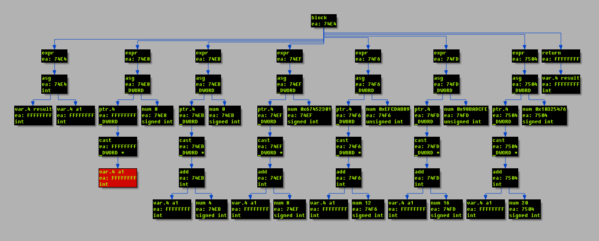
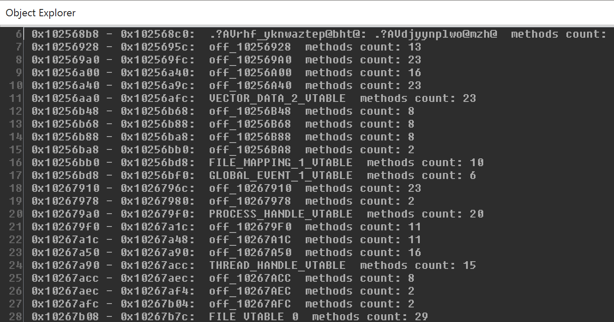

HexRaysCodeXplorer
==================

Hex-Rays Decompiler plugin for better code navigation :octocat:

__Authors and Contributors__: 
Aleksandr Matrosov ([@matrosov](https://github.com/matrosov)); Eugene Rodionov ([@rodionov](https://github.com/rodionov)) 

__HexRaysCodeXplorer__ - Hex-Rays Decompiler plugin for easier code navigation. Right-click context menu in the Pseudocode window shows HexRaysCodeXplorer plugin commands: 

__Here are the main features of the plugin:__

* Automatic type REconstruction for C++ objects. To be able to reconstruct a type using HexRaysCodeXplorer one needs to select the variable holding pointer to the instance of position independed code or to an object and by right-button mouse click select from the context menu «REconstruct Type» option:

  The reconstructed structure is displayed in “Output window”. Detailed information about type Reconstruction feature is provided in the blog post “[Type REconstruction in HexRaysCodeXplorer](http://rehints.com/2013-09-02-Type-REconstruction-in-HexRaysCodeXplorer.html)”.

  From version 1.1 supporting auto reconstruction type into IDA local types storage.

  
* C-tree graph visualization – a special tree-like structure representing a decompiled routine in c_itemt terms. Useful feature for understanding how the decompiler works. The highlighted graph node corresponds to the current cursor position in the HexRays Pseudocode window:

* Navigation through virtual function calls in HexRays Pseudocode window. After representing C++ objects by C-structures this feature make possible navigation by mouse clicking to the virtual function calls as structure fields:

* Object Explorer – useful interface for navigation through virtual tables (VTBL) structures. Object Explorer outputs VTBL information into IDA custom view window. The output window is shown by choosing «Object Explorer» option in right-button mouse click context menu:

__From version 1.1 was inluded folowing features:__
* auto structures for VTBL into IDA local types
* click on VTBL and jump to code
* ObjectExplorer hints for VTBL
* start suporting RTTI objects parsing

